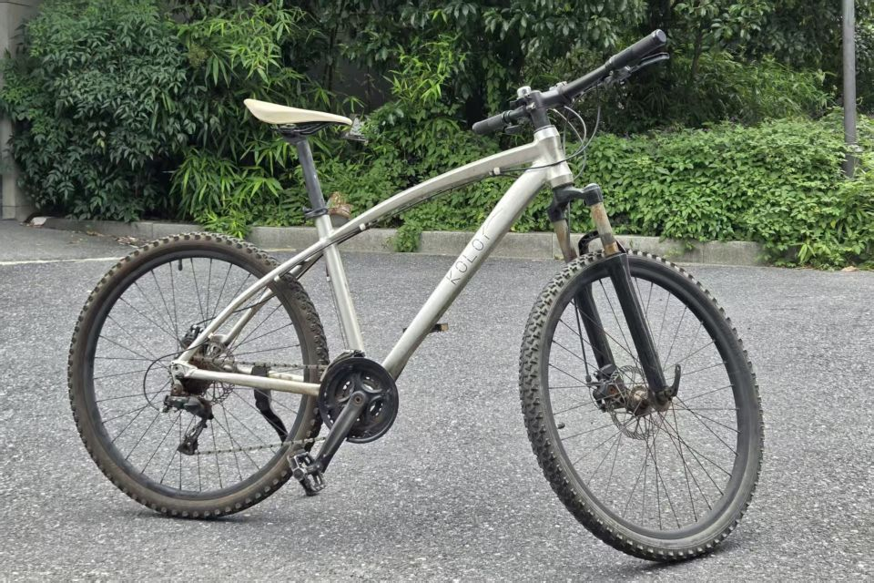

&emsp;&emsp;今年雨季来临前的一天，我像往常一样打算骑车下班，刚一踩上踏板，就听见哗啦啦一声，脚踏板开始空转。我原以为只是链条掉了，检查后发现是链条断了。一来没有备用链条，二来缺乏工具和知识，想要立即修好断无可能，我决定把它暂时安置在车棚的西本角，等雨季过后再来修理。

## 骑行往事

&emsp;&emsp;我学会骑自行车是在上小学的时候，当时骑的自行车好像是爸妈在营业厅充话费送的礼品。我不仅仅是学会了一项技能，交通工具的进步也拓展了我和小伙伴们出门玩耍时的活动半径。到了初中时，那辆自行车又成为我每天上下学和回家吃午饭的代步工具，省下了不少时间和力气。

&emsp;&emsp;高中我开始了寄宿生活，远离了自幼熟悉的小镇，每天只是疾步往返于宿舍楼和教学楼之间，不明所以地想拥有一辆山地自行车。回到家和爸妈沟通后，他们并不扫兴，而是支持我网购了我人生中的第一辆山地自行车。我选的是一个不太知名的品牌—— *Kolor* ，它的设计和颜色至今仍然很合我的审美。虽然事情已过去近十年，我仍然清晰地记得爸爸陪我前往市郊的物流场地取货的情景，我们一起完成了车轮、车把手的组装，然后我径直骑车返回学校。

## 修复计划

&emsp;&emsp;我的修复计划不仅包括更换链条，还包括车座、把套的更换。这几年我注意到这个自行车品牌似乎变得知名一些了，我咨询他们店铺的在线客服后，购得了一条 *TEC* 牌的新链条。在随后的日子里，我又陆续买好了车座、把套和一个新车铃，然后等候雨季结束。

## 安装链条

&emsp;&emsp;出梅的第三天，我开始实施我的维修计划。首先是将那条布满铁锈、形如槁木的旧链条从自行车的前后飞轮上取下，我有一点懊悔没有在它新断的当天就将它取下，因为之前读过的科普文中有提到铁锈如果不及时清理，附着在金属表面会加快锈蚀的过程。好在飞轮上的锈蚀似乎没有加重。

&emsp;&emsp;**截链器** 是安装链条的必要工具之一，这是我第一次使用这种工具，我非常欣赏这类结构简单却精巧好用的机械，它既可以用于挤出销钉从而拆卸原链条或者截断长链条，又可以用来压入销钉从而连接链条的两端。相比之下，链条的另一种安装方式是使用快拆扣安装，这需要将快拆扣套在链条两端的链轴上，然后用力拉紧即可，这种安装方式未必不牢靠，但由于快拆扣和链条并非同生共体，我认为不如使用销钉安装来得优雅。

自行车链条的安装步骤：

1. **拆卸旧链条** - 如果原链条还未断，需要使用截链器将其截断后取下
2. **截取新链条** - 将新链条和原链条对齐后，截取保留相同的节数，注意截取后的链条两端必须都是内链片
3. **连接新链条** - 将新链条装上并使用截链器或快拆扣进行连接，此时 **链条钩** 会十分有用

## 回归骑行

&emsp;&emsp;更换坐垫、把套和车铃比较容易实施，分别使用不同型号的内六角扳手就可以完成拆装。经过这次修理，这辆年近一旬的山地车在我眼里算是焕然一新，链条还浸润着薄薄的一层机油，转动顺滑而安静，米白色的坐垫干净整洁，新车铃的声音清脆响亮，骑行感受好极了。

&emsp;&emsp;在国内大大小小的城市中，非机动车道上的主角都是电动车，我所在的城市也不例外。伴随近几年城市骑行运动的兴起，车道上的自行车也多了起来，其中的公路车是远多于山地车的。在我上下班的路上，时常有骑行圈的人士或者自行车爱好者轻松地把我超过，他们总是彼此跟随，很少相互追赶，由此可见骑车人身上似乎罕有“路怒”的症状，我自然也不会为我的骑行速度而感到难堪。而我车速偏慢的原因并不单纯是无力与公路车们争锋，也是因为修好车后我愈加珍视这辆陪伴我多年的老车。

## 思想实验

&emsp;&emsp;链条并非这辆老车最先抱恙的部件，前后飞轮和轮圈上的辐条，早已像刚换下的旧链条一样锈迹斑斑，外胎表面的裂纹在渐渐增多，整车的变速系统、后轮的碟刹也有或大或小的问题。在未来，某个关键部件的彻底失灵将使我再次拿起工具，或换或修，力求恢复它原本正常、安全骑行的功能。这是我人生的第一辆山地自行车，我试想通过不断的维修和养护，它能否是我的最后一辆山地车呢？假如有朝一日，它的车轮、变速器、刹车，甚至是车架，全都更换过之后，它还是原来的那一辆车吗？

> “如果忒修斯的船上的腐烂的木头逐渐被替换，直到所有的木头都不是原来的木头，那这艘船还是原来的那艘船吗？” 
> —— <cite>普鲁塔克[^1]</cite>

[^1]: 以上引言摘自希腊作家普鲁塔克提出的 [悖论](https://zh.wikipedia.org/wiki/%E5%BF%92%E4%BF%AE%E6%96%AF%E4%B9%8B%E8%88%B9) , 公元 *1* 世纪.

&emsp;&emsp;对于有一定旧物情结的人而言，上述问题的答案应该是肯定的。刚换的零件如同新生的枝叶，由他们组成的整体已经树大根深，承载起了太多的回忆。我们这些人呐，根据那些熟悉的老物件，能寻回旧时光里的自己。

---

_在公路车大行其道的年代，我当他是一个和我一样不懂时髦的老朋友。_
